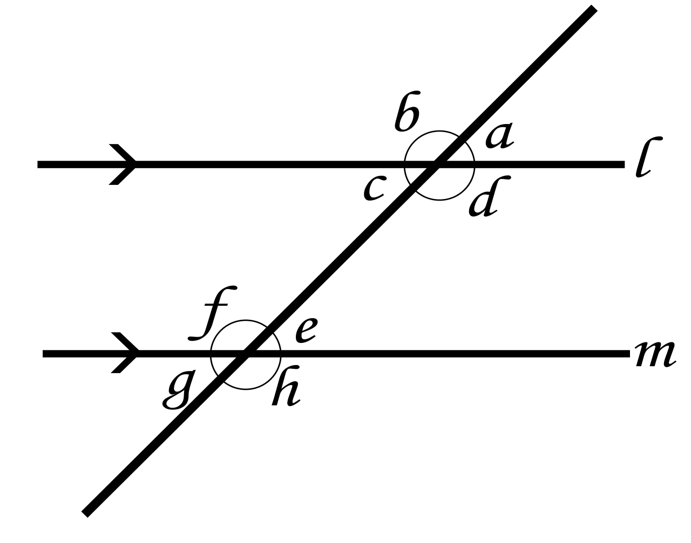
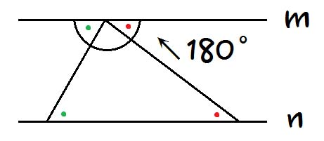
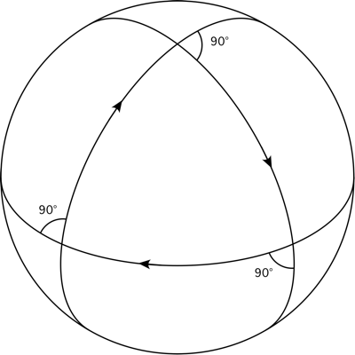

# 들어가기전
엄밀하게 말할경우, 논리학에서 말하는 명제와, 공리 모두 맞지 않다. 비유로 생각하고 읽어 달라.

# 들어가며
운이 좋게 프론트팀을 리드하게 되었다.

팀을 리드하게되면, 규칙을 정하는 일이 생긴다.
최대한 적은 규칙으로 동작하는 팀을 만들고 싶었다.

# 통제가 아닌 맥락을 전달하라
예를 들어, 팀에서 정한 두 규칙은 다음과 같다.

* 세미콜론을 사용할 것인가?
* [Trailing commas](https://developer.mozilla.org/ko/docs/Web/JavaScript/Reference/Trailing_commas)를 강제할것인가?

이 두 상황은 비교적 명확한 답이 있었고, 합의 끝에 규칙을 정할 수 있었다.

하지만 더 곤란한 문제도 생겼다. *함수 선언을 어떤 방법으로 할 것 인가?*라는 문제 였다.
```js
// 1.
function foo(bar) {}

// 2.
function foo({ bar }) {}

// 1.
foo(100)

// 2.
foo({ bar: 100 })
```
함수인자가 3개 이상이거나, optional한 인자가 많다면 후자가 더 적합할 거란 *의견*을 덛붙였지만,
이 문제에 대해선 모호한 결론을 냈는데, *상황에 따라 적합한 방법을 사용하자* 였다.

나는 종종 코드리뷰에서 한가지 일을 하는데에는 가능하면 한가지 방법을 사용할 것을 요청했기 때문에, 결론에 약간의 의아함을 느끼는 경우도 있었는데, 사실 규칙보다는 다음의 원칙을 전달 하고 싶었다.

> 코드는 읽기 쉬워야 한다.

사실 위의 조건만 만족된다면, 세미콜론도, Trailing commas도 *팀이* 어떠한 방법을 택하던 괜찮았던 문제 였다.

나는 *원칙*아래서 라고 표현했고,
넷플릭스에서는 이를[**규칙**이 아닌 **맥락**을 전달하라](https://www.slideshare.net/watchncompass/freedom-responsibility-culture/83)고 설명한다.

리딩을 하면서 드는 고민은 과연 어떤것이 **맥락**이 되어야하며, 어떤것이 **세부사항**이 되어야 하는지의 고민이었고, 생각 끝에 흥미로운 비유가 생각났다.

우리는 **공리**를 정하고 있는 것 이었다.

# 공리(公理)
> 증명없이 참으로 받아들이는 명제

무엇인가를 증명하기 위해서는 정의(定義)가 필요하고, 가정이 필요하다. 이를 타고타고 올라가면 결국 증명할 수 없지만 참이라 받아들여야하는 명제들을 만나게 된다. 이를 공리라고 한다.
수학에서는 한 체계를 만들기 위해선, 필수적으로 공리를 정해야한다.

`유클리드 기하학의` 5가지 공리를 살펴보자

# 유클리드 기하학의 공리
유클리드 기하학은 5가지 공리위에 구축되었다.

1. 어떤 한 점에서 어떤 다른 한 점으로 선분을 그릴 수 있다.
2. 임의의 선분을 선을 따라 다른 선분으로 연장할 수 있다.
3. 어떤 한 점을 중심으로 하고 이에 대한 거리(반지름)로 하나의 원을 그릴 수 있다.
4. 모든 직각은 서로 같다.
5. 두 직선이 한 직선과 만날 때, 같은 쪽에 있는 내각의 합이 2직각(180˚)보다 작으면 이 두 직선을 연장할 때 2직각보다 작은 내각을 이루는 쪽에서 반드시 만난다.

이 중 마지막을 평행선 공리라고 한다. 평행선 공리는 다음과 동치이다.
> 직선 밖의 한 점을 지나 그 직선에 평행한 직선은 단 하나 존재한다.

당연하게 느껴지는 5가지 명제지만, 이는 정의(定義)도 아니며, 증명할 수도 없다.
우리는 5가지 명제를 참이라 받아들이고 유클리드 기하학을 쌓아 올릴 수 있었다.

예를 들어 *삼각형 내각의 합은 180˚이다*의 명제는 위 공리를 이용해 증명이 되었다.


이중 평행선 공리를 이용하여, 동위각의 크기는 같음을 증명할 수 있다. (재귀법을 이용하여 증명한다)
동위각의 크기가 같음을 이용하여 엇각의 크기가 같음을 증명할 수 있다.


그리고 엇각의 크기가 같음을 이용해, 삼각형 내각의 합은 180˚임을 증명할 수 있다.

삼각형 내각의 합도, 피타고라스의 정리도 다양한 법칙들은 위의 5가지 공리를 바탕으로 증명되었다.

따라서 *삼각형 내각의 합은 180˚이다*, *직각삼각형의 빗변이 아닌 변의 제곱의 합은 빗변의 합과 같다*
이 두 명제를 굳이 공리에 추가하지 않아도 유클리드 기하학을 만들수 있다.

이 처럼 공리는 다른 명제를 설명할 수 있다면 최소한 으로 정할 수 있다.

나는 수학에서의 공리처럼 가능한 적은 규칙을 정하길 원했고, 가능하면 다른 규칙들은 미리 정해둔 규칙에 의해서 자연스럽게 정해지길 원했다.

그럼 프로그래밍의 공리를 하나 정의해보자.

# 프로그래밍의 공리
가장 먼저 생각난 공리는
> 코드는 읽기 쉬워야 한다.

였다. 이 문장으로 많은 것을 설명 할 수 있기 때문이다.

앞서 언급한 문제를 생각해보자.
> 세미 콜론을 사용하지 말아야 한다.

일반적인 상황에서는 세미콜론 유/무로 가독성이 크게 차이나지 않는다.

하지만 코드리뷰할때는 달라진다.
```js
foo()
  .bar();
```
이 코드 뒤에 `.barz()`함수를 chaining 한다고 생각해보자.

## 세미콜론을 사용할때
```diff
foo()
- .bar();
+ .bar()
+ .barz();
```

## 세미콜론을 사용하지 않을때
```diff
foo()
  .bar()
+ .barz()
```

세미콜론을 사용하지 않았을때, 더 깔끔한 diff를 확인 할 수 있다! 마찬가지 이유로 [Trailing commas](https://developer.mozilla.org/ko/docs/Web/JavaScript/Reference/Trailing_commas)를 사용하는게 더 읽기 쉬운 diff를 제공해 준다.

마찬가지로 어떤 함수 선언을 사용하더라도, 읽기 쉬운 아름다운 코드가 나온다면 받아들일수 있다.
좀 더 많은 공리를 원한다면 [Zen of Python](https://www.python.org/dev/peps/pep-0020/)을 한번 참고해보자.

그런데, 수학과 달리 현실은 *증명*이 모호하다. 위에서 말한 선택에도 동의하지 못할 수 있다.
또한, 여러 상황을 모두 설명할 수 있는 공리들은 수학에서조차 불가능 하다.

# 힐베르트의 꿈
수학자 힐베르트는 최소한의 공리로 참인 모든 명제를 증명할 수 있는 완벽한 공리계를 만들고자 했다.
힐베르트의 꿈은 잠시 [러셀의 역설](https://ko.wikipedia.org/wiki/%EB%9F%AC%EC%85%80%EC%9D%98_%EC%97%AD%EC%84%A4)로 위기를 맞았지만, 적절한 공리의 추가로 역설을 해결하고 조금씩 꿈을 향해 가는것 같았다.

그런데 러셀의 역설이 해결된지 약 20년뒤 힐베르트의 꿈은 괴델에 의해 무너지게 된다.

# 불완전성 정리
1931년 괴델은 어떤 공리들을 택해도, 참이지만 증명할 수 없는 명제가 있음을 증명하였다.
이를 [불완전성 정리](https://ko.wikipedia.org/wiki/%EA%B4%B4%EB%8D%B8%EC%9D%98_%EB%B6%88%EC%99%84%EC%A0%84%EC%84%B1_%EC%A0%95%EB%A6%AC) 라고 한다.

따라서 어떤 공리계를 만들어도, 모든것이 증명가능한 완벽한 공리계를 만들 수 없다.

재미있는건 힐베르트는 수학자들이 20세기에 풀어야할 [23가지 문제](https://ko.wikipedia.org/wiki/%ED%9E%90%EB%B2%A0%EB%A5%B4%ED%8A%B8_%EB%AC%B8%EC%A0%9C)들을 뽑았는데, 이중, 첫번째 문제인 연속체 가설이 참도 거짓도 없는 문제임이 밝혀졌다.

# 평행선 공리의 부정
다시 유클리드의 공리로 돌아가자. 유클리드의 공리중 마지막 평행선 공리는 다른 공리들과 달리 쉽게 이해되지 않는다.

사실 수학자들도 평행선 공리는 공리가 아니라 다른 공리로 유도할 수 있는 것이 아닌지 의심을 했다.
그러나 다른 공리로 평행선 공리를 증명할 수 없었고, 수학자들은 평행선 공리가 거짓이라고 가정하고 모순이 생길 수 있는지 확인하려 했다. (모순이 있다면 평행선 공리는 당연히 참임이 증명된다.)

그런데 평행선 공리가 거짓이라고 가정해도 모순이 없었다. 평행선 공리는 참이어도 거짓이어도 된다!

아니 그런데, 참 이면서도 거짓 일수 있을까? 이는 조건에 따라 달라진다.
평행선 공리에 의해서 삼각형의 내각의 합이 180˚임을 증명했다면, 평행선 공리가 참이 아니라면 내각의 합이 180˚가 아닌 삼각형도 있을 것 이다.


구에서 삼각형을 긋는다면, 세 각이 모두 직각인 삼각형을 만들 수 있다. 세 각의 합을
유클리드 기하학은 평면에서만 성립한것 이었으며, 이로 인해 비 유클리드 기하학이 탄생하게 된다.
위 구면 삼각형은 그중에서도 구면 기하학 이다.

유클리드 기하학, 구면기하학 모두 다 실용적이며, 구면 기하학은 현실에 더 어울리기 까지 하다.

# 남은 과제들
이 처럼 수학에서 조차 완벽한 공리계는 없다.
우리가 유클리드의 공간이라고 생각하던 지구는, 구면기하학이 더 어울리는 곡면이었다.

> 코드는 읽기 쉬워야 한다.

너무나 당연하게 느껴지는 문장도, 임베디드 세계에선 얼마든지 부정될 수 있다.
그리고 컴파일러의 발달로 다시 참이 될 수도 있다.

> 세미콜론을 사용하지 말자

우리팀이 정한 규칙도 babel이 자동으로 세미콜론을 삽입해 주지 않았다면, 아마 사용하지 않았을 것이다.

상황에 따라 모든건 바귄다. 수학과 달리 우리는 절대적인 문제상황에 있는게 아니다.
그러니 우리가 정해야할 첫번째 공리는 다음과 같다.
> 모든건 바뀔 수 있다.
