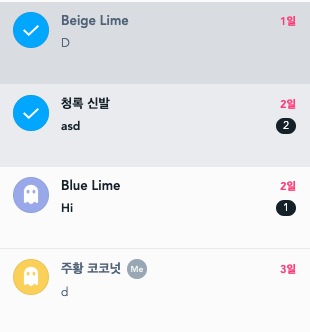
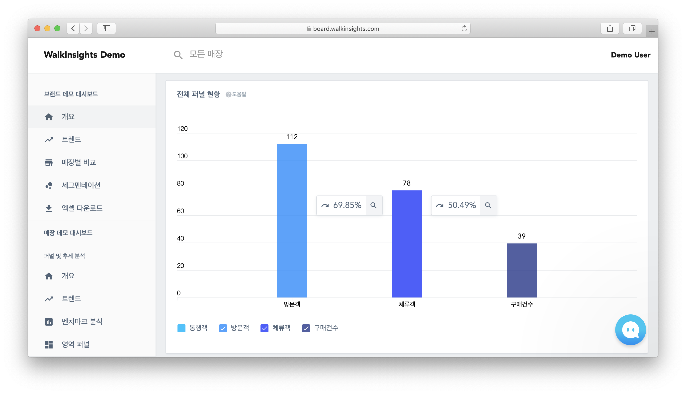

현재 나는 휴학을 하고 [ZOYI](https://zoyi.co)에서 프론트 엔드 개발자로 일하고 있는데,
3년 전 컴퓨터 공학을 전공으로 선택할 때만 해도 프론트엔드 개발을 할 것이라 생각하지 않았다.

몇 가지 이유가 있는데, 첫째로 당시에 미래의 웹 페이지는 모두 포토샵과 같은 WYSIWYG 에디터로 만들 것으로 생각했다.

그때는 **웹앱**을 몰라서 했던 생각이지만, 지금도 정적 페이지, 간단한 쇼핑몰 같은 페이지는 그렇게 될 것으로 생각한다.

둘째로 JavaScript 언어의 난해함과 내 생각대로 작동하지 않는 CSS였다. 특히 [세로 중앙정렬](https://css-tricks.com/centering-css-complete-guide/)은 너무나 이상하게 느껴졌다.

다행히 ES6 이후의 JS의 변화와 [지원 노력](https://babeljs.io/)으로 (내 기준으로) 난해한 언어는 아니며,
CSS는 사용과 공부, flex와 같은 새로운 스타일로 적응 할 수 있었다.

하지만 무엇 보다도, [vimrc.io](https://vimrc.io/)를 만들때 사용한, [React](https://reactjs.org/)의 만족감이 큰 역할을 했다.

# 진료는 의사에게 약은 약사에게
React의 가장 만족스러운 점은 **관심사의 분리** 이다. 예를 들어 게시물 목록을 간단히 React로 작성해보면 다음과 같다.
```jsx
import React from 'react'

class PostList extends React.Component {
  state = {
    isLoading: true,
    posts: [],
    error: null,
  }

  componentDidMount() {
    this.fetchPosts()
  }

  fetchPosts() {
    fetch('SOME_API')
      .then(res => {
        if (!res.ok) {
          throw new Error('로딩에 실패하였습니다')
        }
        return res.json()
      })
      .then(({ posts }) => {
        this.setState({
          posts,
          isLoading: false,
          error: null,
        })
      })
      .catch(e => {
        this.setState({
          error: e.message,
          isLoading: false,
          posts: [],
        })
      }))
  }

  render() {
    const { isLoading, posts, error } = this.state

    if (isLoading) {
      return (
        <div className="spinner" />
      )
    }

    if (error) {
      return (
        <div className="error">
          {error}
        </div>
      )
    }

    if (posts.length === 0) {
      return (
        <div>게시글이 없습니다</div>
      )
    }

    return (
      <div>
        {posts.map(post => (
          <div key={post.id}>{post.title}</div>
        ))}
      </div>
    )
  }
}
```
여전히 한 파일에 있지만, 각 영역은 철저히 자신의 역할만 책임진다.
* `fetchPosts`함수는 API를 요청하고, 그 결과를 처리한다.
  - fetchPosts 함수는 HTML 렌더링은 신경쓰지 않고 데이터만 처리한다.
* `render`함수는 상태에 따라 필요한 HTML을 렌더링한다.
  - React 같은 라이브러리의 장점은, 매번 새로 렌더링을 하기 때문에, 이전 상태를 고려 하지 않고 지금의 상태만 처리하면 된다.

이제 원한다면 두 함수를 완전히 분리할 수도 있다.
```jsx
import React from 'react'

function PostList({ isLoading, posts, error }) {
  if (isLoading) {
    return (
      <div className="spinner" />
    )
  }

  if (error) {
    return (
      <div className="error">
        {error}
      </div>
    )
  }

  if (posts.length === 0) {
    return (
      <div>게시글이 없습니다</div>
    )
  }

  return (
    <div>
      {posts.map(post => (
        <div key={post.id}>{post.title}</div>
      ))}
    </div>
  )
}

class PostContainer extends React.Component {
  state = {
    isLoading: true,
    posts: [],
    error: null,
  }

  componentDidMount() {
    this.fetchPosts()
  }

  fetchPosts() {
    fetch('SOME_API')
      .then(res => {
        if (!res.ok) {
          throw new Error('로딩에 실패하였습니다')
        }
        return res.json()
      })
      .then(({ posts }) => {
        this.setState({
          posts,
          isLoading: false,
          error: null,
        })
      })
      .catch(e => {
        this.setState({
          error: e.message,
          isLoading: false,
          posts: [],
        })
      }))
  }

  render() {
    const { isLoading, error, posts } = this.state
    return (
      <PostList
        isLoading={isLoading}
        error={error}
        posts={posts}
      />
    )
  }
}
```
`PostList`는 렌더링만 책임을 지며, `PostContainer`는 주로 데이터를 가져오는 것을 책임진다.
이러한 접근법은 재사용성을 크게 강화하는데, 이제 다른 컴포넌트에서도 `PostList`가 원하는 데이터 형식만 맞춘다면, 동일한 컴포넌트를 여러곳에서 사용할 수 있게 된다.

이렇듯, React는 관심사의 분리와 렌더링과 DOM 이벤트 관리를 쉽게 도와주었지만, **데이터 관리**라는 어마어마한 폭탄도 가져왔다.

# 골드버그 장치

> 나쁜 프로그래머는 코드에 대해 걱정 하고, 좋은 프로그래머는 데이터 구조와 관계를 걱정 한다

리누스 토발즈의 [발언](https://lwn.net/Articles/193245)이며, 개인적으로 토발즈의 발언중 가장 좋아하는 발언이다.

React-Redux 앱을 만들면 더더욱 데이터와 그 흐름의 중요성을 느끼게 된다.
일부는 React의 단방향 데이터흐름, Redux의 구조 때문이지만 (그러나 두 특징 모두 버그를 줄이고, 역할을 나누는데 큰 도움을 준다),
보다 근본적으로는 기능에 따른 독립적인 또는 공통의 상태들이 필요하기 때문이다.


* 어떤 데이터는 **여러곳**에 연관되어 있지만, 어떤건 아니다
  - 위의 유저 채팅 목록 처럼, 리스트는 여러 곳에서 필요한 부분만 가져가서 사용하지만, 선택 여부는 일부 컴포넌트만 가지고 있다.
* 어떤 데이터들은 *여러곳에서* 서로 다르게 가공하여 사용할 수도 있다.
  - 어떤 컴포넌트는 데이터를 모두 활용해야 한다.
  - 어떤 컴포넌트는 조건에 따라서 일부 데이터만 사용한다.
  - 서로 다른 데이터를 합치거나, 평균을 구하거나, 가공할 필요가 생긴다 (예: 차트)

데이터의 구조와 규모 뿐만 아니라 이들을 가공하는것도 만만하지 않다.
* 어떤 작업(가공)은 지나치게 오래걸린다.
* 어떤 작업들은 선행 작업들이 필요하다.

# 데이터는 어디서 왔으며, 무엇이고, 어디로 가는가?

여기에 서버로부터 데이터를 가져온다면 더 가정해야할 것들이 생긴다.
* 어떤 API*들*은 다른 API에 의존적이다.
  - 한 API의 결과에 따라 호출이 될수도 아닐 수도 있다.
  - 한 API가 호출된 후 호출해야 한다.
  - 성능 문제로 (예: 너무 잦은 렌더링) 한번에 묶어서 결과를 처리 해야 할 수도 있다.

* API의 프로토콜, 형식이 모두 다를 수 있다.
  - 많은 경우 JSON HTTP API를 사용할 것이다.
  - 실시간 데이터 처리를 위해 WebSocket을 사용 할 수도 있다.
  - HTTP 프로토콜을 사용해도, graphql처럼 한 엔드 포인트에 서로 다른 정보를 넘겨야 할 수도 있다.
  - IndexDB, WebSQL, LocalStorage을 이용해 로컬에서 데이터를 사용할 수도 있다.

이처럼 지금의 프론트엔드 특히 웹앱은 *어떻게 보일것인가*는 물론 **데이터를 어떻게 관리할 것인가**도 고민해야 하며, 데이터의 규모와 복잡도는 앞으로도 커질 수 있다.

# 거인의 어깨 위
위의 고민은 꼭 프론트만 가지고 있는건 아니다.
* 어떤 API*들*은 다른 API에 의존적이다.
* API의 프로토콜, 형식이 모두 다를 수 있다.
  - 서로 다른 DB 엔진에서 가져올 수도 있다. (RDBMS, NoSQL)
* 어떤 데이터들은 *여러곳에서* 서로 다르게 가공하여 사용할 수도 있다.
  - 일반적으로 SQL의 JOIN을 사용하는 API가 적어도 하나는 있을 것이다.
* 어떤 작업은 지나치게 오래 걸린다

백엔드 생태계는 이런 상황을 먼저 겪었으며, 각각의 해법들 (SQL, Repository, Task Queue)을 만들며 발전하게 되었다.

# 수렴진화


> React 생태계는 백엔드와 닮아서 좋아요.

회사에서 같이 일하는 개발자에게 들었던 말이다. 처음 이 말을 들었을때는 잘 이해하지 못했지만, 점점 공감이 가기 시작했다.


현재 ZOYI에서는 크게 두 팀이 있는데, 그 중 [워크인사이트](http://walkinsights.com/)오프라인 고객분석을 하는데, 데이터를 시각화 하여 보여주는 대시보드 개발에 참여했다.

[데모 대시보드](https://board.walkinsights.com/#/demo)를 개편하는 일을 맡았을때, 데모 대시보드는 여러 이유로 다른 API와 다른 방식으로 데이터를 가져와야 했다.

이때 최대한 컴포넌트와 리듀서 구조는 유지하고 싶었고, (위의 발언을 한 개발자는) 스프링프레임워크와 같은 백엔드에서 주로 사용한 Repository 패턴을 추천해 주었다.
```jsx
class UserRepositry {
  getUser(userId) {
    return fetch('USER_API_ENDPOINT')
  }
}

// fetch api 함수를 흉내낸 함수
function mockFetch(data) {
  return new Promise(resolve => {
    resolve({
      status: 200,
      ok: true,
      json: () => data,
    })
  })
}

class DemoUserRepository {
  getUser(userId) {
    return mockFetch({
      id: 1,
      name: 'Demo User',
      // ...
    })
  }
}
```
처음에는 데모페이지에 사용하는 API가 추가될때마다 두개의 Repository가 생기는게 귀찮았지만, 점점 진가가 발휘되었다.
* UserReducer - DemoUserReducer, UserAction - DemoUserAction 등등 로직은 곂치지만, 재사용하지 못한 데이터 레이어를 활용 할 수 있었다.
* 테스트를 할때 Repository만 교체해주면 되었다.
  * 물론 fetch api를 mocking 할 수도 있지만, 이 편이 더 깔끔했다.

물론 이런 해결법을 우리만 사용하는건 아니다.

## MobX
사내에서 그리고 많은 React 앱들이 상태관리를 위해 Redux를 사용하지만, 다른 상태관리 라이브러리들도 많다.

Redux를 제외한 라이브러리중 단연 눈에띄는 라이브러리는 [MobX](https://github.com/mobxjs/mobx)인데, 재미있게도 MobX에서는 Repository 패턴을 권장한다.
MobX의 Store, Repository 사용법은 Java의 Spring과 꽤 유사한데, 자세한 내용은 우아한 형제들의 [React에서 Mobx 경험기 (Redux와 비교기)](http://woowabros.github.io/experience/2019/01/02/kimcj-react-mobx.html) 글을 추천한다.

## Immutable.js
[Immutable.js](https://immutable-js.github.io)는 Facebook에서 JS의 불변성을 위해 만든 라이브러리다. 현재 일하고 있는 [채널](https://channel.io) 팀에서는 Immutable.js를 적극적으로 활용하고 있는데, Immutable.js의 진가는 [Record](https://immutable-js.github.io/immutable-js/docs/#/Record)라고 생각한다.

```jsx
const PersonRecord = Record({ name: 'Aristotle', age: 2400 });
class Person extends PersonRecord {
  getName() {
    return this.get('name')
  }

  setName(name) {
    return this.set('name', name);
  }
}
```
채널에서는 대부분의 데이터를 Record를 활용해 표현하며, `models`폴더에 따로 관리하고 있다. Reducer에서 필요한 방식으로 사용하고 있다.
위의 Person Model은 마치 [Django Models](https://docs.djangoproject.com/en/2.1/topics/db/models/)처럼 보인다.

게다가 여러 데이터를 업데이트 할때도 `setIn`과 같은 함수를 사용하니 더더욱 백엔드에서 사용한 모델들 처럼 느껴진다.

## Reselect
[Reselect](https://github.com/reduxjs/reselect)는 Redux의 Selector를 구현 하는데 도움을 주는 라이브러리다.
Redux의 Selector는 `react-reudx`의 `connect`함수의  `mapStateToProps` 부분이라고 생각하면 된다.

처음 Reudx를 사용하게 되면, 보통 `mapStateToProps` 부분에서 아래처럼 사용하게 된다.
```jsx
import { connect } from 'react-redux'

const mapStateToProps = (state) => ({
  user: state.UserReducer.user,
})

connect(mapStateToProps)(UserInfo)
```
그런데 `UserInfo`가 서로 다른 리듀서에서 데이터를 가져올 뿐만 아니라, 그 값을 가공하게 된다면? `render` 함수에서 가공할 수도 있겠지만, 그리 좋은 방법은 아니다.
이때 Reselect를 쓰면 다음과 같이 구현할 수 있다 (코드는 reselect 문서에서 가져와 수정했다)

```jsx
import { connect } from 'react-redux'
import { createSelector } from 'reselect'

const shopItemsSelector = state => state.shop.items
const taxPercentSelector = state => state.shop.taxPercent

const subtotalSelector = createSelector(
  shopItemsSelector,
  items => items.reduce((acc, item) => acc + item.value, 0)
)

const taxSelector = createSelector(
  subtotalSelector,
  taxPercentSelector,
  (subtotal, taxPercent) => subtotal * (taxPercent / 100)
)

export const totalSelector = createSelector(
  subtotalSelector,
  taxSelector,
  (subtotal, tax) => ({ total: subtotal + tax })
)

const mapStateToProps = (state) => ({
  total: totalSelector(state),
})

connect(mapStateToProps)(Tax)
```

위 코드를 보면 `subtotalSelector`와 `taxSelector`는 각각 다른 리듀서에서 데이터를 가져와 가공하며, `totalSelector`는 다시 두 셀렉터를 사용해 가공한다.
Redux는 **하나의 상태트리**만 가지기 때문에 `state`에서 모든 데이터를 가져올 수 있기에 가능한 방식이다.

reselect를 사용하면 Reducer는 자신의 데이터만 가지고 있고, 여러 Selector를 활용해 가공하게 되니 Reducer의 역할을 DB의 Table 처럼 만들어 준다.
게다가 [Memoized](https://github.com/reduxjs/reselect#creating-a-memoized-selector)기능도 있어, 불필요한 렌더링을 줄여준다.

## Normalizr
[normalizr](https://github.com/paularmstrong/normalizr)는 데이터 정규화 라이브러리이다.
Redux를 사용해보면 중첩된 (nested)된 데이터는 불변성을 유지하기가 꽤 귀찮은데, 이를 쉽게 하기 위해 데이터 형식을 가공하게 해준다.
공식문서의 코드를 가져와 보면

다음의 데이터는
```json
{
  "id": "123",
  "author": {
    "id": "1",
    "name": "Paul"
  },
  "title": "My awesome blog post",
  "comments": [
    {
      "id": "324",
      "commenter": {
        "id": "2",
        "name": "Nicole"
      }
    }
  ]
}
```

다음의 코드를 이용해
```jsx
import { normalize, schema } from 'normalizr';

// Define a users schema
const user = new schema.Entity('users');

// Define your comments schema
const comment = new schema.Entity('comments', {
  commenter: user
});

// Define your article
const article = new schema.Entity('articles', {
  author: user,
  comments: [comment]
});

const normalizedData = normalize(originalData, article);
```

다음 처럼 변환된다.
```js
{
  result: "123",
  entities: {
    "articles": {
      "123": {
        id: "123",
        author: "1",
        title: "My awesome blog post",
        comments: [ "324" ]
      }
    },
    "users": {
      "1": { "id": "1", "name": "Paul" },
      "2": { "id": "2", "name": "Nicole" }
    },
    "comments": {
      "324": { id: "324", "commenter": "2" }
    }
  }
}
```
변환하기전 데이터를 보면 `comments[0].commenter`의 데이터를 변경하였을때, Reducer에서 변경을 인지하게 만들기가 까다로운데 비해, 변환 후 코드는 더 쉬워진다.
Entity를 이용해 API Respose의 구조를 표현하는 곳도 재미 있지만, 더욱 재미 있는건, 변환후 데이터인데 마치 DB에서 Foreign key를 사용한것 처럼, ID만 가지고 있는걸 볼 수 있다.

추가로 변환된 데이터들을 Immutable.js를 이용해 저장하면 `Users.get(id)`처럼 마치 백엔드에서 ORM을 사용하는 것처럼 사용할 수 있다.

아직 채널팀에서는 사용하지 않고 있지만, 개인적으로 눈여겨 보고 있다.

## Redux-Saga
[Redux-Saga](https://redux-saga.js.org/)는 인기있는 Redux Side Effect 관리 라이브러리이다.
`fork`, `task`, `race`등등 쓰레드를 활용하는 것과 매우 유사한 경험을 제공해준다.
워크인사이트 팀에서 사용하였는데, 특히 소켓을 활용할때 경험이 좋았다.

이 외에도 `Task Queue - WebWorker`등등 그간 백엔드에서 복잡도를 낮추기 위해 또는 관심사와 레이어를 나누기위해 사용한 여러 방법들을 React-Redux 생태계에서 활용할 수 있다.

# 마치며
현재의 프론트엔드는 점점 복잡해지고 있으며, 점점 더 많은 권한을 가지게 되고 있다.

프론트엔드를 단순하게만 생각하고 있거나 혹은 정반대로 복잡한 상태/작업 관리의 해결법의 모티브를 찾고 계시다면 이렇게 답하고 싶다.

> 프론트엔드는 백엔드의 꿈을 꾸고 있다.

# 첨언
샤딩처럼 백엔드만 가지고 있는 특성과 문제가 있는것 처럼, 프론트엔드만 가지고 있거나, 프론트엔드에서 더 문제가 되는 것들도 있다.
* 번들파일 특히 JS 용량은 적어야 한다.
  - JS파일은 파일을 읽은 후 파싱 -> 컴파일 -> 실행을 해야하니 용량의 증가가 더욱 치명적이다.
* JS의 실행속도는 빨라야한다.
  - 당연히 백엔드도 빨라야하지만, 더 좋은 서버를 이용할 수 있는 백엔드와 달리, 사용자의 기기를 업그레이드 할 수 없다.
  - *일단은* 싱글쓰레드기 때문에 None-Blocking관리가 더 중요하다.
  - 60fps 렌더링이 되면 더할나위 없다.
* 보기 좋아야 한다 :)
* 클라이언트 기기가 모두 다르다
  - 아쉽게도 아직 IE를 사용하는 분들도 계시다 :(

JS의 Event Programming이 IO가 잦은 곳에 유용하다는 생각으로 [Node.js](https://nodejs.org)가 탄생한 것 처럼,
15년 전부터 웹앱(Gmail)을 만든 구글은 반대의 사례가 있을지 궁금하다.

또하나,

[채널](https://channel.io)과 [워크인사이트](https://walkinsights.com/) 모두 큰 규모의 웹앱을 가지고 있으며,
위와 같이 다양한 방법으로 많은 문제를 해결해가고 있고 매일 도전적인 과제를 해결하고 있다.

특히 채널팀에 오게된다면 쉽게 경험해볼 수 없는 많은 프론트 문제를 만나고, 해결할 수 있다!

프론트이외에도 [여러 직군을 모집중](https://zoyi.co/ko/jobs)이니 많은 관심 가져주시면 감사하겠습니다 :)
