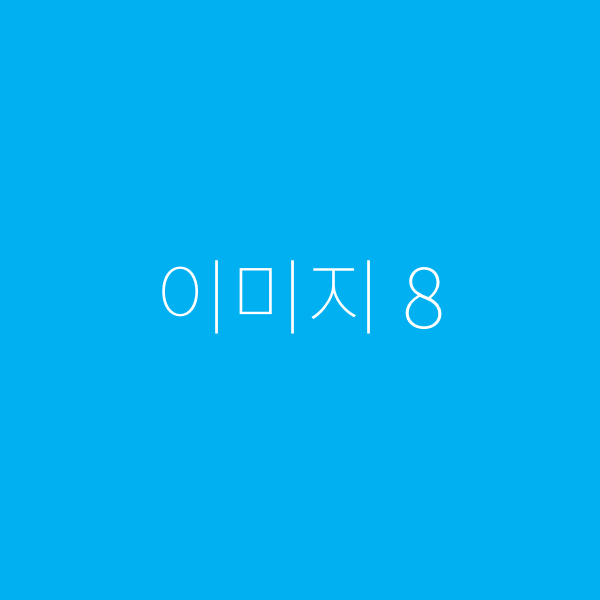

# 들어가며
레티나 디스플레이를 시작으로 다양한 고밀도 디스플레이 기기가 늘어났습니다.
이에 따라 웹에서도 고 해상도 이미지의 수요가 생겼습니다.
고 해상도 이미지를 제공하는 방법을 알아봅니다.

# Media Queries: resolution feature
`resolution`은 고밀도 디스플레이를 위해 고안된 css문법으로,
IE9를 포함한 [브라우저 대부분](https://caniuse.com/#feat=css-media-resolution)이 지원합니다.
문법은 `(min/max)-resolution: 값`으로 사용되며, 기본 단위는 dppx입니다.

이 미디어쿼리를 사용하면 고밀도 디스플레이와 저밀도 디스플레이에 서로 다른 이미지를 보여줄 수 있습니다.
```html
<figure>
  
  
</figure>
```
```css
.img-retina {
  display: none;
}
@media only screen and (min-resolution: 2) {
  .img-retina {
    display: initial;
  }
  .img-normal {
    display: none;
  }
}
```
`background-image`를 사용할 것이면 다음과 같이 쓸 수 있습니다.
```css
.img-retina {
  background-image: url(...);
}
@media only screen and (min-resolution: 2) {
  .img-retina {
    display: background-image: url(...);
  }
}
```
하지만 아쉽게도 safari는 `min/max-device-pixel-ratio` 문법만을 지원하고 있어 다음을 사용해야 합니다.
```css
@media only screen and (-webkit-min-device-pixel-ratio: 2) {
  /**/
}
```
또한 오페라미니와 IE는 dppx를 지원하지 않기 때문에 적당한 dpi를 사용해야 합니다.
```css
@media only screen and (min-resolution: 192dpi) {
  /**/
}
```
결과적으로 IE9을 포함한 대부분 브라우저를 지원하려면 다음 문법을 사용하면 됩니다.
```css
.img-retina {
  display: none;
}
@media only screen and (-webkit-min-device-pixel-ratio: 2), only screen and (min-resolution: 192dpi), only screen and (min-resolution: 2dppx) {
  .img-retina {
    display: initial;
  }
  .img-normal {
    display: none;
  }
}
```
덤으로 만약 파이어 폭스와 오페라 이전 버전을 지원하고 싶다면 다음과 같은 미디어 쿼리를 추가하면 됩니다.
```css
@media only screen and (min--moz-device-pixel-ratio: 2), only screen and (-o-min-device-pixel-ratio: 2/1) {
  /**/
}
```
`resolution` 미디어 쿼리를 사용하면, 브라우저 대부분을 지원하자만, 그러기 위해서는 미디어 쿼리가 복잡해지는 문제가 있습니다.
게다가 한가지 문제가 더 생기는데 브라우저의 **동시 연결 제한** 문제입니다.

# 동시 연결 제한
HTTP 1.1의 표준인 [RFC 2616](https://www.w3.org/Protocols/rfc2616/rfc2616-sec8.html#sec8.1.4)의 8.1.4절을 살펴보면 다음과 같은 내용이 있습니다.
> Clients that use persistent connections SHOULD limit the number of simultaneous connections that they maintain to a given server.

한국전자통신연구소의 번역본은 다음과 같습니다.
> 지속적인 접속을 사용하는 클라이언트는 특정 서버로의 동시 접속 숫자에 제한을 두어야 한다.

실제로 브라우저들은 *도메인당 최대 연결수를 제한하고 있습니다*. 그 수는 브라우저 마다 다릅니다.

| 브라우저 | 도메인당 최대 연결 수 |
|---|---|
|Internet Explorer® 7.0 |	2 |
|Internet Explorer 8.0 & 9.0 | 6 |
|Internet Explorer 10.0 | 8 |
|Internet Explorer 11.0 |	13 |
|Firefox® | 6 |
|Chrome™ | 6 |
|Safari® | 6 |
|Opera® | 6 |

사파리를 예로 들면, 한 웹페이지의 같은 도메인 한번에 받아 올 수 있는 이미지는 최대 6개 입니다.
```html





```


위 이미지를 보시면 최대 6개의 네트워크 연결을 확인할 수 있습니다.

[여기에서](./same-domain-multiple-images.html) 직접 확인해 보실 수 있습니다.
> 동일 도메인 연결 제한을 피하고 성능향상을 위해 CDN 서비스를 사용하기도 합니다.

중요한 점은 브라우저는 보여지지 않는 파일도 가져옵니다. 즉, `display: none` 혹은
무시된 `background-image`도 가져옵니다.
```html


```


위 이미지를 확인해 보시면 사용하지 않는 `normal-img-2.png`와 `normal-img-3.png`도 받아오는걸 확인 할 수 있습니다.

마찬가지로 [여기에서](./same-domain-multiple-images-with-none.html) 확인할 수 있습니다.

결국 resolution 미디어 쿼리를 이용해 이미지를 다룰경우, 불필요한 이미지도 모두 받아오게 됩니다.
따라서 고밀도 유저나 일반 유저나 모두 약 2배 가까운 이미지를 받게됩니다. 여러 이미지를 사용하는 페이지라면,
보이지 않는 이미지를 받는 도중 도메인 연결 제한에 걸려 보여줘야할 이미지를 받는데 더 시간이 걸릴 수도 있습니다.
> 단, background-image를 이용할 경우에는 필요한 이미지만 받아옵니다.
따라서 가능하다면 **보여줘야할 이미지만 선택해서 받아오게 해야합니다**. 그럼 다른 방법은 없을 까요?

# JS를 이용해 동적으로 가져오기
`window.devicePixelRatio` ([IE 11](https://caniuse.com/#feat=devicepixelratio)부터 지원)을 사용하거나,
위에 있는 미디어 쿼리를 적용한 element 상태를 보고 적합한 이미지를 가져오는 방법도 있습니다.

이 방식을 사용하실 거면, [retinajs](https://github.com/strues/retinajs)를 추천합니다.
retinajs는 css js를 모두 지원하고 특히 다음과 같은 문법을 지원하는데요,
```html


<!-- or -->

<div
  style="background: url(/images/my_image.png)"
  data-rjs="/images/my-image@2x.png">
</div>
```
이렇게 사용하면, 일반 디스플레이 이용자들은 `/images/my_image.png`만을 받아 올 수 있습니다.

하지만 여전히 고밀도 이용자들은 여러 이미지를 받거나, 깜박임을 겪는 문제를 겪습니다.

# srcset
HTML 5.1 부터 img element에 [srcset](https://www.w3.org/TR/html51/semantics-embedded-content.html#element-attrdef-img-srcset) 속성이 추가 되었습니다.
현재 IE와 오페라미니를 제외한 모든 브라우저 에서 [지원하고 있습니다](https://caniuse.com/#feat=srcset).

`srcset`은 조건에 따라 다른 이미지를 가져오게 할 수 있는데요 다음과 같은 문법으로 사용합니다.
```html

```
쉼표로 구분하며, 앞에 조건과 사용할 이미지를 적으면 됩니다.
`resolution`이 2이상인 디스플레이와 일반디스플레이를 구분해 이미지를 보여주려면 다음과 같이 사용합니다.
```html

```
srcset을 사용하면 브라우저는 적합한 이미지만을 선택해 가져옵니다.

위 이미지를 보시면 `image-src.png`나 `image-1x.png`를 받지 않고 `image-2x.png`만 받는걸 확인 할 수 있습니다.
[여기에서](https://webkit.org/demos/srcset/) 직접 확인해 볼 수 있습니다.

어떤 조건에도 해당 되지 않거나, 이미지를 가져올 수 없다면 `src`에 있는 이미지를 가져오게 됩니다.
```html

```
예를 들어 위와 같이 작성하면 2x, 3x ... 밀도를 가진 기기는 `image-2x.png`를 가져오고,
`srcset`을 지원하지 않는 브라우저나 일반 디스플레이는 `image-src.png`을 가져오게 됩니다.

따라서 `srcset`을 지원하지 않는 브라우저도 (비록 상대적으로 흐린 이미지 겠지만) 이미지 자체는 표시가 될 뿐더러,
불필요한 이미지를 가져오지 않아, 성능에도 도움이 됩니다.

## 덤
`srcset`으로 가져온 이미지는 한가지 특징을 가지게 됩니다.
```html

```
다음과 같이 HTML을 작성하였고, image-2x.png는 200px*200px 크기의 이미지 라면,
`img`에 `width: 100%`를 주었어도 100px*100px으로 표시됩니다.

따라서 이미지 크기를 반드시 2배 키워서 사용해야 크기 실수를 방지 할 수 있습니다.
safari는 개발자용 > 응답형디자인모드 에서 최대 3x 까지 디스플레이 밀도를 조정하며 확인해 볼 수 있습니다.

### img-set
css에도 img-set이란 속성이 있습니다. 아쉽게도 현재는 사파리와 크롬만 [지원하고](https://caniuse.com/#search=image-set) 있는데요,
다음과 같은 방법으로 사용할 수 있습니다.
```css
.test {
  background-image: url(image-1x.png);
  background-image: -webkit-image-set(url(image-1x.png) 1x, url(image-2x.png) 2x);
  height:75px;
}
```
아쉽게도 사파리와 크롬만 지원하지만 `srcset`처럼 fallback이 있으므로 콘텐츠에 문제를 만들지 않으며, 적합한 이미지만 골라 받아 오게 됩니다.

하지만,
```css
.img-retina {
  background-image: url(...);
}
@media only screen and (min-resolution: 2) {
  .img-retina {
    display: background-image: url(...);
  }
}
```
위의 css를 사용해도 적합한 파일만을 받기 때문에 현재로썬 복잡한 미디어 쿼리를 작성하기 싫을 경우에 유용합니다.

# 결론
* 문서 상단처럼 고밀도 디스플레이에 서로 다른 HTML Element를 보여줘야 한다
* 동적으로 이미지를 가져오는 것이 싫다
* IE에도 고해상도 이미지를 보여주고 싶다

`resolution` 미디어 쿼리를 이용하세요.

* IE를 지원해야 합니다
* 동적으로 이미지를 가져와도 좋다.

자바스크립트를 이용해 구현하여 사용합니다. 개인적으로는 retinajs를 추천합니다.

그외의 경우에는 `srcset`과 사용하시는 것을 권장합니다.
