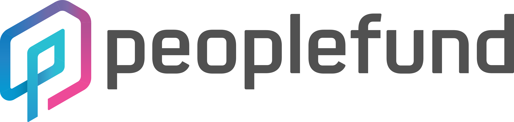

저에게 작년은 엄청난 한 해 였습니다.
* [스타수 100 이상의 오픈소스](https://github.com/sn0wle0pard/ipytracer)를 만들었고
* [PyConKR](https://www.pycon.kr/2017/program/135)에서 발표를 했으며
* [Python](https://github.com/python/cpython/pull/3085)에 기여 했고
* 새로운 스킬 자바스크립트가 생겼습니다!

여기에 또 한가지 약 10개월간 스타트업에서 인턴을 했습니다.

저는 UNIST(울산과학기술원)에 다니고 있습니다.
학교를 다니며 아쉬운 점중 하나는 주변에 IT 기업이 거의 없다는 점 입니다.
게다가 저는 지리적, 개인적인 사정으로 쉽사리 방학을 이용한 인턴을 할 수 없었습니다.
몇가지 이유로 휴학을 하였고, 운좋게도 [피플펀드](https://www.peoplefund.co.kr/)에서 인턴을 할 수 있었습니다.



이 글은 10개월간 제가 느낀점을 기록한 것 입니다. 이 글이 다른분들께도 도움이 되었으면 좋겠습니다.
특히 저와 같은 고민을 했던 분들께 조금이나마 도움이 되었으면 좋겠습니다.

# Back to the basic
> 정확하게 알고 쓰자

피플펀드 사무실에 붙어 있는 문구 입니다. 저는 기술을 익힐때 보통,
1. 간략한 소개글을 보고 배울지 결정한다
2. 튜로리얼을 따라 간단한 토이 프로젝트를 만들어 본다
3. GitHub에서 모범사례를 참고하며 공부한다
4. 필요할때마다 검색해 지식을 얻는다
5. 구현원리를 알아보기 위해 노력한다

의 과정을 거쳐 기술을 익혔습니다. 때로는 꼼꼼히 처음부터 단계를 밞았지만 일반적으로는 위와 같이 기술을 익혔습니다.

기초지식 까지 알기 위해 [노력](http://localhost:4000/2017/pythons-innards-introduction/)[들](https://www.slideshare.net/Sn0wLe0pard/layer-model)도 많이 했지만, 놓치고 있던 것들도 많았습니다.
몇가지 제가 느낀 사례를 공유하겠습니다.

## RDBMS
새로운 기술은 언제나 멋지고, 기존 기술 보다 좋아 보입니다. 저에겐 특히 NoSQL이 그렇게 보였고 (속도, 비정형 데이터 저장 등등),
개인 프로젝트에서는 대체제로 문제가 없어 보였습니다. 하지만 피플펀드는 *P2P* **금융**서비스 업체 이므로 DB의 정확성은 엄청나게 중요한 문제 였습니다.

결국, **[ACID](https://ko.wikipedia.org/wiki/ACID)**보장을 해주는 RDBMS와 NoSQL은 대체제가 아닌 보완제 였습니다.

### MySQL
제가 겪은 문제중 하나는, MySQL은 기본적으로 문자열의 [대소문자](https://dev.mysql.com/doc/refman/5.7/en/case-sensitivity.html)를 구별하지 않았습니다.
예를 들어 아래 코드로 Model을 정의하면 얼핏 보기에는 문제 없어 보였지만,
```python
from django.db import models


class SomeModel(models.Model):
    name = models.CharField(max_length=250, unique=True)
```
`python manage.py shell`를 실행하고 다음 코드를 입력하면 아래와 같은 에러가 발생합니다.
```python
>>> SomeModel.objects.create(name='sn0wle0pard')
<SomeModel: SomeModel object (1)>
>>> SomeModel.objects.create(name='Sn0wle0pard')
...
django.db.utils.IntegrityError: (1062, "Duplicate entry 'Sn0wle0pard' for key 'name'")
```
정확하게 알고 쓰지 않아 생긴 문제는 때때로 발견하기 어려웠습니다.

## ORM
저는 ORM을 좋아합니다 (여담이지만 커뮤니티 슬랙에서 Raw SQL을 선호하는 개발자도 많다는걸 알았습니다).
더 프로그래밍 언어에 친화적인 코드를 작성할 수 있고, 유지보수도 쉬워지며, 실수도 줄일 수 있으니까요.
네, 저는 ORM을 [은탄환](https://ko.wikipedia.org/wiki/은제_탄환)으로 여겼습니다.

실제로 개인프로젝트에서는 SQL 지식을 거의 가지지 않고도 충분히 사용가능해 보였습니다.
하지만 ORM은 은탄환이 아니었습니다.

* ORM으로 표현이 어려운경우
* ORM을 비효율적으로 사용한 경우

전자는 대표적으로 일부 통계가 있었습니다. 후자는 프로젝트가 커지면서 점점 문제로 다가 왔고,
ORM의 특성을 잘 이해하지 않으면 DB에 엄청난 무리를 줄 수 있다는 점을 알게 되었습니다.

피플펀드 개발팀이 ORM 성능 향상을 위해 알아보고 적용한 내용은
[Django DB 최적화](https://peoplefund-dev.github.io/2017/11/03/django-db-optimization.html)
포스트에서 자세히 보실 수 있습니다.

부끄럽게도 전 DB 및 SQL 공부를 소홀히 하였고, 그렇다고 ORM의 특성을 잘 이해하고 있던것도 아니었습니다.
아래 글은 Django ORM에 대한 제가 추천하는 글 입니다. (Django 공식문서는 기본 입니다!)

### 좋은글
* [Django DB 최적화](https://peoplefund-dev.github.io/2017/11/03/django-db-optimization.html) :)
* [Django에서 쿼리셋 효과적으로 사용하기](http://raccoonyy.github.io/using-django-querysets-effectively-translate/)
* [django 쿼리셋 수정을 통한 웹서비스 성능 개선](https://wayhome25.github.io/django/2017/06/20/selected_related_prefetch_related/)
* [(엑셀만큼 쉬운) Django Annotation/Aggregation](http://raccoonyy.github.io/django-annotate-and-aggregate-like-as-excel/)

## 그외
그외에도 몇가지
(예: [피플펀드 성능개선기](https://peoplefund-dev.github.io/2017/11/04/performance-improvements-of-peoplefund.html)중 *소켓 연결 제한*)
일을 보거나 겪고 나니 DB, Network, OS 등등 기초지식의 중요성을 세삼스레 깨닫게 되었습니다.

### 좋은글
* [그런 REST API로 괜찮은가](http://slides.com/eungjun/rest#/)
* [eungju 님의 블로그](https://blog.npcode.com/)

# 더 나은 코드를 위해서
이전에도 코드리뷰 같은 문화는 알았지만, 현장에서 느낀 점도 많았습니다.

## 테스트, 테스트, 테스트!
가장 강조하고 싶고, 많이 느낀점 입니다. 학교 과제를 하면서 테스트 코드를 작성하는 일은 드무니까요.

저는 인턴을 하면서 처음으로 유닛테스트에 대해 알게 되었습니다.

예를 들어 주어진 문자열이 올바른 형식의 이메일인지 확인하는 함수 `is_right_email`을 만들었다고 하죠.
그럼 아래와 같은 테스트 코드를 만들 수 있습니다.
```python
import unittest

from some_module import is_right_email


class TestSomeModule(unittest.TestCase):
    def test_email(self):
        self.assertEqual(is_right_email('test@test.com'), True)
        self.assertEqual(is_right_email('test@test'), False)
```
이렇게 하면 코드에 문제가 있는지 미리 파악할 수 있을 뿐더러,
추후에 `is_right_email`함수를 리팩토링 할때도 큰 도움이 됩니다 (테스트를 모두 통과해야 되므로).

솔직히 처음에는 조금 귀찮은 작업이었지만 테스트 코드를 작성하는 도중에 내 코드의 문제점을 발견하고 고친적도 있으며,
테스트 코드를 철저하게 작성했다면 미리 발견했을 문제도 겪었습니다.

### 좋은글
* [유닛테스트에 대한 생각](https://blog.outsider.ne.kr/1275)

## Type
이 문제는 [타입 전쟁](http://blog.cleancoder.com/uncle-bob/2016/05/01/TypeWars.html)으로 유명하기도 하고,
개인의 취향도 많이 타는 문제 입니다.
그렇지만 TypeScript, Python 3.6 부터 들어온 typing 등등 많은 프로그래밍 언어가 정도는 다르지만 타입정보 제공을 지원하고 있습니다.
협업을 하다보니 강타입 까진 아니더라도 Type Hinting을 위한 Type Annotation 정도는 있는게 많은 도움을 준다고 느꼈습니다.

## 자동화
여러 업무를 겪다보면 반복되는 작업이 생깁니다. 그냥 지나칠수도 있지만 이런 문제를 정형화 하고,
해결하는 습관은 결과적으로 업무량도 줄이고 실수도 줄일 수 있습니다.

# 클라우드 시대
AWS는 프리티어를 주기도 하고, 학생혜택도 있기 때문에 이전부터 사용하긴 했습니다.
개인적으로 AWS를 사용하게 되면 보통 EC2만 간단하게 사용하게 되고, 결국 `다른 가상 호스팅과 다를게 뭐지?`,
`왜 개발자들이 열광하는 걸까?`라는 의문을 가지고 있었습니다.

회사에 들어오기 전에 `serverless` 아키텍쳐를 흥미롭게 보고, 몇 가지 토이 프로젝트를 만들면서 DynamoDB, S3, Lambda 등등
필요에 따라서 필요한 만큼만 사용하는 클라우드의 장점을 일부 알게 되었습니다.

인턴으로 일하며 느낀 장점은 자동화와 고가용성 입니다.
RDS, ECS, CloudWatch 등등이 제공하는 여러 기능들은 그동안 **일일히 관리 해야 했던 일들을 자동화 해줬습니다**.
스타트업에 있어 개발자는 특히 비싼 자원입니다. 개발자의 할일과 실수를 줄이는 건 엄청난 이득일 뿐만아니라 더 우선순위가 높은 일을 처리할 수 있게 해줬습니다.

추가로 비싸보였던 여러 소프트웨어도 프로그래머 명의 일을 대신한다는 관점에서 보면 (특히 프로그래머 월급보다 싸다면) 합리적인 가격으로 느낄수 있었고요.

비단 클라우드 뿐만 아니라 New Relic 같은 APM,
Travis CI, Circle CI 같은 CI/CD, Sentry 같은 log 분석 시스템, Serverless, Apex등 Serverless Framework
등등 클라우드에 맞춰진 다양한 소프트웨어들도 인상 깊었습니다. SaaS, FaaS의 편리함도 포함해서요.

## 좋은 글
* [스티브의 구글 플랫폼 폭언](http://egloos.zum.com/eggry/v/3763434)

# 자율과 규율 사이
> 스타트업의 장점은 논의의 여지가 남아있다는 점이다

[빠르게 성장하는 회사](http://news.mk.co.kr/newsRead.php?year=2017&no=608429)에서 인턴을 하면서,
회사 문화를 합의하는 과정 그리고 성장통을 같이 겪고 지켜볼 수 있었습니다.

특히 저는 사업을 꿈꾸고 있어 느낀점이 많았습니다.

## 어떻게 소통하고 일할 것인가?
저는 스타트업의 장점을 자유로운 소통이라고 생각했습니다. 그런데 경우에 따라서는 소통도 규칙이 필요합니다.
앞서 말했듯 스타트업에 있어 개발자는 비싼 자원이고, 개발자가 해결해야 하는 문제는 상당히 많습니다.
일의 우선순위가 바뀔수도 있고, 생각만큼 일이 진행되지 않을 수도 있습니다.
이런상황에서 자꾸만 새로운 문제가 들어온다면요? 먼저 해결하고 있던 문제는 어떻게 된걸까요?
이렇듯 여러 문제의 진행상황을 알리고, 우선순위를 정하고, 코드의 품질을 유지하기 위해서는 일하는 데도 규칙이 필요했습니다.
피플펀드에서는 여러 개발 방법론, 에자일 스크럼, JIRA 같은 소프트웨어를 적용해보고 좋은 방법을 찾아가고 있었습니다.

아쉽게도 이 고민은 끝나지 않았습니다. 사실 여러 대기업도 계속해서 하는 고민이기도 하고요 :(

### 좋은글
* [페이스북은 어떻게 개발하고 배포할까?](http://www.venturesquare.net/553623)
* [어느 스타트업의 애자일 스크럼와 JIRA에 대한 연구 문서](http://luckyyowu.tistory.com/370)
* [개발그룹은 어떻게 일을 하는가? #1](http://blog.dramancompany.com/2016/03/개발그룹은-어떻게-일을-하는가-1)

# 마치며
약 10개월의 인턴을 마치고, 이제 복학 준비를 하고 있습니다.
이번학기는 프로그래밍 기초지식을 더 쌓고, 더 좋은 흥미로운 프로그램을 만들기 위해 노력할 것입니다.
올 한해도 더 큰 성장을 이룰 수 있었으면 좋겠습니다.

[GitHub](https://github.com/sn0wle0pard),
[LinkedIn](https://www.linkedin.com/in/sn0wle0pard/)
