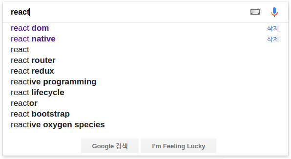

> 2016년 부터 현재까지 가장 화제가 되는 자바스크립트 라이브러리는 단연 React입니다. 본격적인 강좌에 앞서 React에 대해 알아 봅시다.

# 동적 웹
웹이 점점 복잡해지면서 정적 웹에서 벗어나 동적 웹 페이지가 많아지고 있습니다. 동적 웹에서는 사용자는 웹 페이지에서 데이터를 변경하고, 웹페이지는 변경된 데이터에 따라 컨텐츠를 생성합니다.

구글 검색을 예로 들어 보죠. 구글 검색은 검색어 추천을 제공해 주고 있습니다. 사용자가 단어를 입력하면 서버에 데이터를 요청 하고, 받아온 데이터를 토대로 추천 검색어를 보여줄 HTML을 그려냅니다.
이는 HTML 만으로는 불가능한 일이죠.

따라서 자바스크립트의 역할은 점점 커지고 있습니다. 동적인 웹에서 자바스크립트는 *변하는 데이터*에 맞추어 *적합한 컨텐츠*를 생성하는 일을 해야 합니다.

# React
React는 Facebook에서 만든 자바스크립트 라이브러리 입니다. React는 이름 처럼 데이터 변화에 잘 *반응* 합니다. 데이터의 변화를 잘 파악하고 변경할 부분을 효과적으로 적용합니다.

## DOM
우선 DOM이야기를 해보죠, DOM은 Document Object Model의 약자로, 문서 객체 모델이라고 합니다. HTML 및 XML 문서를 처리하기 위해 만들어진 API입니다.
브라우저는 HTML을 읽고 트리 형태의 DOM을 생성합니다.


출처: [위키피디아](https://en.wikipedia.org/wiki/Document_Object_Model)

> Tip: DOM에 대해 더 알고 싶으시다면 [모질라 개발 사이트](https://developer.mozilla.org/ko/docs/DOM)를 추천 드립니다.

### 동적인 웹에서 DOM의 문제점
DOM은 정적인 HTML에 맞추어져 있습니다. 따라서 동적 웹에서는자바스크립트를 통해 DOM을 관리해야 합니다.
이 때문에 기존에는 jQuery 등을 사용하여 데이터가 변경 되었을 때 변경될 필요가 있는 곳을 일일이 지정하고 업데이트 하였습니다.
그런데, 변경해야할 곳이 엄청나게 많다면요? Facebook과 같은 대규모 웹에서 일일이 id나 class를 지정하고 데이터를 변경하는 코드를 작성하는것은 매우 귀찮고 힘들 것 입니다.

또한 브라우저는 DOM의 변화가 발생하면 다시 레이아웃과 스타일을 변경하는 과정을 거칩니다. 효율적으로 DOM을 조작하지 않는 다면 대규모 웹에서는 이 시간과 비용 또한 많이 발생할 것 입니다.

그럼 데이터가 변경되면 자동으로 그리고 효과적으로 DOM을 변경할 수 있다면 어떨까요? React에서는 이 문제를 해결하기 위해 Virtual DOM을 도입 했습니다.

## Virtual DOM
Virtual DOM은 자바스크립트로 만들진 가상 DOM 입니다. React Virtual DOM을 만들고 실제 DOM에 반영합니다.

이때 Ract는 데이터가 변하면 자동으로 다시 렌더링 하는데, 우선 DOM을 직접 변경 하는게 아니라 Virtual DOM을 변경 합니다.
Virtual DOM은 실제로 렌더링 되지 않기 때문에 레이아웃의 크기 우선순위 등을 세세히 계산할 필요가 없어 비교적 빠르게 생성됩니다.
그 후 React에서는 기존 Virtual DOM과 비교하여 *변경된 부분만 DOM에 반영*합니다. 이로 인해 React는 효과적으로 DOM을 변경합니다.

## 단방향 데이터 흐름
React와 데이터의 또다른 특징은 데이터는 항상 부모에서 자식 방향으로만 흐릅니다. 자식 컴포넌트에서 부모 컴포넌트로는 데이터를 *직접* 전달 할 수 없습니다.

## 뷰만 담당하는 라이브러리
React는 MV* 패턴에서 오직 V만 담당 합니다. 그렇기에 UI 이외의 것들은 다른 자바스크립트 라이브러리를 조합하여 사용해야 합니다.

## JSX
React를 특별한 템플릿 엔진을 사용하고 있지 않습니다. 이미 자바스크립트는 충분히 강력하기 때문 인데요. 대신에 JSX라는 일종의 자바스크립트/HTML 확장 문법을 제공합니다.
JSX는 Babel과 같은 도구로 자바스크립트로 컴파일 됩니다.

예를 들어 이 JSX 코드는
```jsx
const element = (
  <h1 className="greeting">
    Hello World {someValue}
  </h1>
);
```
다음과 같이 변환됩니다.
```js
const element = React.createElement(
  "h1",
  { className: "greeting" },
  "Hello World ",
  someValue
);
```
React는 JSX사용을 강제하지 않습니다. 순수 자바스크립트 만으로도 코딩을 할 수 있습니다. 하지만 위의 코드에서 볼 수 있듯 JSX를 사용하면 훨씬 깔끔한 코드를 만들 수 있습니다.

참고로 이 코드에서 `someValue` 값이 변경되면 브라우저에는 자동으로 `Hello World someValue값`이 표시 됩니다.
이걸 기존의 자바스크립트로 구현하려면 셀렉터로 `div`를 선택하고 데이터가 변경될 때마다 업데이트를 해줘야 겠지요?

# 결론
React는 데이터 변화에 효과적으로 반응하는 UI를 만들 수 있는 자바스크립트 라이브러리 입니다. 점점 복잡해지는 웹 환경에서 React는 좋은 해결책이 될 것 입니다.

글에 잘못된 점이 있다면 언제든지 알려주세요. 확인후 반영하겠습니다. :)
